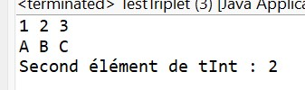
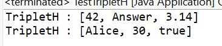

# TP Java – Génériques : Triplet et TripletH

## Objectifs pédagogiques

- Comprendre la définition et l’utilisation des classes génériques en Java.  
- Manipuler un paramètre de type unique (`<T>`) et des paramètres multiples (`<A, B, C>`).  
- Écrire du code type-safe, réutilisable et extensible.  
- Explorer les notions de bornes de types (`extends`, `super`) pour contrôler la généricité.

---

## Exercice 1 – Triplet Homogène

### Objectif
Définir une classe générique simple `Triplet<T>` permettant de stocker et manipuler trois objets du même type, tout en conservant la sécurité de type.

### Description
La classe Triplet<T> :  
- Contient trois éléments du même type T.  
- Fournit des accesseurs pour chaque élément.  
- Dispose d’une méthode `affiche()` pour visualiser le contenu.

### Points Clés
- `<T>` définit un paramètre de type générique.  
- Le compilateur empêche de mélanger plusieurs types dans un même Triplet<T>.  
- Sécurité de type garantie sans cast.

### Fonctionnalités
- Création de Triplet<Integer> et Triplet<String>.  
- Utilisation des accesseurs pour récupérer les éléments.  
- Affichage du contenu dans la console.

### Capture d’écran

---

## Exercice 2 – Triplet Hétérogène

### Objectif
Étendre la notion de générique à plusieurs paramètres de type pour gérer des objets de types différents dans la même structure.

### Description
La classe TripletH<A, B, C> :  
- Contient trois éléments de types potentiellement différents.  
- Fournit des accesseurs spécifiques à chaque type.  
- Dispose d’une méthode `affiche()` pour visualiser le contenu.

### Points Clés
- Les paramètres `<A, B, C>` permettent de mélanger des types.  
- Chaque méthode `getXxx()` retourne le bon type, sans cast.  
- Permet une grande flexibilité dans la composition d’objets.

### Fonctionnalités
- Exemple 1 : TripletH<Integer, String, Double>  
- Exemple 2 : TripletH<String, Integer, Boolean>  
- Affichage clair des trois valeurs dans la console.

### Captures d’écran
**Résultat du programme :**  

---

## Synthèse

| Aspect | Triplet<T> | TripletH<A,B,C> |
|--------|------------|----------------|
| Type de générique | Homogène (un seul type) | Hétérogène (types différents) |
| Paramètres | `<T>` | `<A, B, C>` |
| Objectif | Sécurité de type simple | Flexibilité multi-type |
| Utilisation | `Triplet<Integer>` | `TripletH<Integer,String,Double>` |

---

## Conclusion

Ces deux exercices illustrent :  
- L’utilisation d’un **paramètre de type unique**.  
- L’utilisation de **paramètres multiples** pour des types différents.  
- Les principes de réutilisabilité, sécurité de type et extensibilité en Java.  

Ils fournissent une base solide pour manipuler les génériques et concevoir des structures de données flexibles et robustes.
